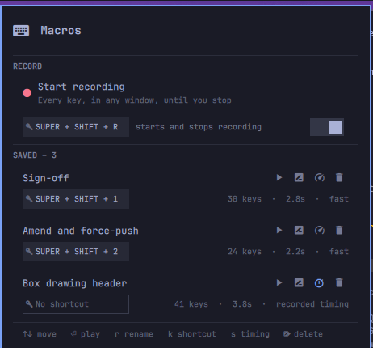

# Macros

An Omarchy shell plugin that records what you type anywhere on the system and
plays it back.

Press a key, type the thing, press it again, and the take is waiting in the
bar. Give it a name and it is kept; give it a shortcut and it becomes a
Hyprland binding you can fire from any window. The keys are recorded and
replayed as raw evdev codes, so a macro means the same thing on every keyboard
layout.



## What it does

- **Records everywhere, not just in one app.** It reads the keyboard itself,
  so a macro recorded in a terminal replays into a browser, a form, an editor,
  or a game.
- **Keeps the takes worth keeping.** Stop a recording and the panel comes back
  with it in hand. Name it and it is saved; discard it and it is gone.
- **Replays at your choice of speed.** A fixed 12ms per key by default, or the
  pauses that were really there when an application needs the time.
- **Binds nothing until you say so.** A key for starting and stopping a
  recording is *proposed*, with a switch in the panel that binds it. Being
  installed does not entitle a plugin to a key on your keyboard.
- **Takes its keys with it.** The generated Hyprland bindings check that the
  plugin still exists before registering, so removing the plugin removes its
  shortcuts — no uninstall step, no stale binds, and Omarchy has no uninstall
  hook to run one from.
- **Says what is missing.** `bin/macros doctor` reports on the recorder, the
  sudoers rule, the packages and the ydotoold socket, and the panel shows the
  one command that fixes them.
- **Does not run when it is not running.** The bar polls only while a
  recording is going or the panel is open, and a recording stops on its own
  after ten minutes.

## Install

```bash
omarchy plugin add https://github.com/hpolthof/omarchy-macros.git --enable
~/.config/omarchy/plugins/io.github.hpolthof.macros/bin/macros-setup
```

The second command is the part that needs a password. Reading keystrokes means
reading `/dev/input` and replaying them means writing `/dev/uinput`, and
neither is available to a normal user — see
[what it costs in privileges](#what-it-costs-in-privileges) for exactly what
goes where and why. It prints every step, and it is safe to run again after a
plugin update.

Until it has been run, the panel opens on a list of what is missing with that
command underneath it.

### Dependencies

| Used for | Needs |
|----------|-------|
| Reading the keyboard | `python-evdev` |
| Replaying it | `ydotool` |

Both come from the Arch repositories and are installed by `macros-setup`.

## Using it

- **Click the icon** to open the panel, or to stop a recording that is
  running.
- **Right-click** to start a recording without opening anything, or to throw
  away one that is running.
- **Starting a recording closes the panel**, because whatever you type while
  the panel has focus goes into the panel and not into the macro.
- **Stopping** brings the panel back with the take in hand.

The icon is a keyboard when idle, a pulsing red dot while recording, and a
floppy disk when a take is waiting to be named.

In the panel: `↑↓` move, `⏎` play, `r` rename, `k` shortcut, `s` timing,
`⌦` delete. In the save form, `⇥` moves between the name and the shortcut,
`⏎` saves, and `Esc` closes the panel without losing the take.

### Replay timing

- **Fast** (default) replays at a fixed 12ms per key. This is what you want
  almost always.
- **Recorded timing** replays the pauses that were actually there, with
  anything over two seconds shortened. Useful when an application needs time
  between keystrokes.

Either way the replay follows an absolute schedule rather than sleeping
between keys, so a long macro does not drift by the cost of every process it
spawns, and every modifier is released first — a macro fired from a keybinding
is not typed with SUPER still held down.

### The record shortcut

Starting a recording is the one thing you cannot do from the panel while your
hands are already where the macro belongs, so the plugin proposes a key for
it: **`SUPER + SHIFT + R`**, free on a stock Omarchy.

It is only proposed. **Nothing is bound until you turn the switch on** in the
RECORD section. Click the chip next to the switch to choose a different
combination.

Once it is on, the same key starts and stops, and the panel and the bar
tooltip both show which key that is. Stopping with the key means it is held
down while the recorder is still reading, so it would end up at the tail of
the macro; the plugin knows its own shortcut and trims that chord off — but
only when the run really is that chord, so a macro that genuinely ends in `r`
keeps its `r`.

### Macro shortcuts

Click the shortcut field on a macro and press the combination. At least one
modifier is required, so a macro cannot fire while you are typing normally.

Shortcuts become Hyprland bindings in `~/.config/hypr/macros.lua`, which this
plugin generates and rewrites — do not edit it. It is loaded by one
`pcall(require, "hypr.macros")` line appended to `~/.config/hypr/bindings.lua`;
`pcall`, so that deleting a generated file can never take the whole config
down with it.

Every binding in that file is guarded by a check that this plugin is still
installed, so **removing the plugin removes its keys**.

A combination Hyprland already has a binding for never reaches the capture
field: the compositor consumes it first. If pressing a combination does
nothing, that combination is taken.

### From a keybinding or a script

```
omarchy-shell -q io.github.hpolthof.macros toggle           # open the panel
omarchy-shell -q io.github.hpolthof.macros toggleRecording  # start/stop recording
omarchy-shell -q io.github.hpolthof.macros play <macroId>
```

Everything the panel does is also available from `bin/macros` — run it with no
arguments for the list.

## What it costs in privileges

| What | Where | Why |
|------|-------|-----|
| Recorder | `/usr/local/lib/omarchy-macros/omarchy-macro-recorder` | Runs as root, reads the keyboards, writes the key stream to stdout. Takes no arguments. |
| Sudoers rule | `/etc/sudoers.d/omarchy-macros` | Lets you start that one binary without a password, so a prompt does not interrupt a recording. |
| ydotoold | `/etc/systemd/system/omarchy-macros-ydotoold.service` | Injects the replay. Runs as root and hands you one socket, mode 0600, instead of putting you in the `input` group where every process you run could read your keyboard. |

The recorder takes no arguments on purpose. The sudoers rule names that path
and nothing else, so a recorder that accepted an output file or a device path
would turn a rule about recording keystrokes into a root shell. Everything
else — the files, the shortcuts, the playback — runs as you, in `bin/macros`,
and needs no password at all.

Both templates are in [`system/`](system/), so you can read exactly what
`macros-setup` will write before you run it.

### The honest part

While it is recording, this is a keylogger. It captures every key on every
window, including passwords typed into anything at all. Three things limit
that, and none of them make it untrue:

- It only records between an explicit start and stop.
- The bar shows a pulsing red dot the entire time.
- A recording stops on its own after ten minutes.

Macros are plain JSON in `~/.local/share/omarchy-macros/macros/`. Read them,
and delete anything you would rather not keep.

## Removing it

The shortcuts need no cleanup — they check for the plugin before registering,
so removing it takes them with it:

```bash
omarchy plugin remove io.github.hpolthof.macros
```

To clear the rest as well, **before** removing the plugin:

```bash
~/.config/omarchy/plugins/io.github.hpolthof.macros/bin/macros-setup --uninstall
~/.config/omarchy/plugins/io.github.hpolthof.macros/bin/macros uninstall
```

The first takes out the recorder, the sudoers rule and the service. The second
takes out `macros.lua` and the line in `bindings.lua`, and keeps your recorded
macros — pass `--all` to delete those too.

## Layout

| File | What it is |
|------|-----------|
| `bin/macros` | Everything that is not drawing: recording, storage, shortcuts, playback. Prints JSON for the panel, text for a person. |
| `bin/macros-setup` | Installs and removes the two privileged pieces. The only thing here that asks for a password. |
| `system/` | What `macros-setup` puts in place: the recorder, and templates for the sudoers rule and the service. |
| `BarWidget.qml` | The bar icon. Owns every call into `bin/macros` and mirrors the results into the panel. |
| `Panel.qml` | The panel. Renders what the widget hands it and calls back; holds no state of its own. |
| `Model.js` | Pure helpers shared by both: parsing, formatting, key-name mapping. |

MIT.
